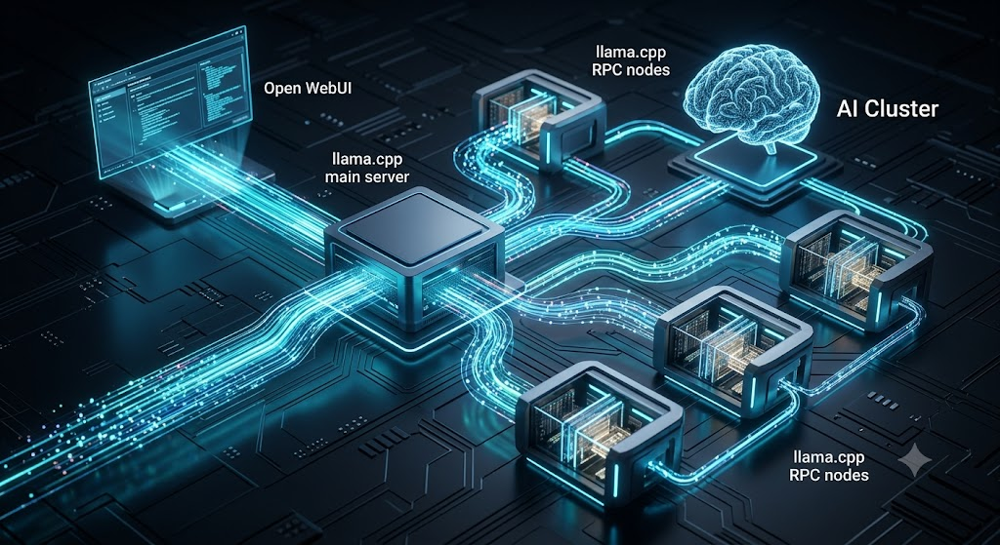

# Distributed AI Cluster: Open WebUI & llama.cpp RPC (1 Head, 2 Workers)
<p align="center">
  
</p>

**Script created by:** andrii.sadovskyi@gmail.com  
**Core Model:** Gemma-3-1B-IT (Q4_K_M)

## Architecture Overview
This repository provides a production-ready, secure, and automated deployment of **[llama.cpp](https://github.com/ggml-org/llama.cpp)** and **[Open WebUI](https://docs.openwebui.com/)** utilizing Docker Compose. The configuration implements a distributed cluster topology, establishing a `llama-server` (Head Node) that offloads workloads to two independent `ggml-rpc-server` (Worker Nodes) over an isolated internal Docker bridge network.

### Security Posture & Hardening
1. **Gated Model Authentication**: Securely injects Hugging Face tokens via `.env` files to comply with Google's Gemma 3 license requirements without hardcoding secrets.
2. **Immutability & Least Privilege (`:ro`)**: Model weights are mounted as Read-Only. Root capabilities are explicitly dropped via `cap_drop: ALL` and `no-new-privileges:true` ([Docker Security Best Practices](https://docs.docker.com/engine/security/)).
3. **Network Isolation**: The RPC worker nodes have no exposed host ports, strictly adhering to the official upstream warning: *"Never run the RPC server on an open network"*.

## Deployment Pipeline

### Prerequisites
1. **Docker Engine & Docker Compose V2**: [Official Installation Guide](https://docs.docker.com/engine/install/).
2. **Hugging Face Authentication**: You must accept the Gemma 3 terms of use on Hugging Face and generate a fine-grained access token with read permissions.

### 1. Configure the Environment
Create a `.env` file in the root directory to pass your token to the initialization container securely:
```bash
echo "HF_TOKEN=hf_your_actual_token_here" > .env
```
### 2. Launch and Compile the Infrastructure
Start the stack in detached mode. Use the `--build` flag to initiate the multi-stage CMake compilations for the RPC endpoints directly from the official upstream repository.
```Bash
docker compose up -d --build
```
### 3. Observability & Initialization Monitoring
Track the automated downloader fetching the model files in real-time:
```Bash
docker compose logs -f model-downloader
```
Verify the head node has successfully established TCP connections with both RPC worker nodes:
```Bash
docker compose logs -f llama-server-head
```

## Health Checks & External Verification
### A. Internal Container Health (Docker Engine)
Verify that all services have successfully transitioned to a `(healthy)` state and the custom-built workers are running natively:
```Bash
docker compose ps
```
Expected output format:
```Plaintext
NAME                 IMAGE                                STATUS                     PORTS
model-downloader     alpine:latest                        Exited (0)                 
llama-rpc-worker-1   <build-context>                      Up 2 minutes               
llama-rpc-worker-2   <build-context>                      Up 2 minutes               
llama-server-head    <build-context>                      Up 2 minutes (healthy)     127.0.0.1:8080->8080/tcp
open-webui           ghcr.io/open-webui/open-webui:main   Up 1 minute (healthy)      0.0.0.0:3000->8080/tcp
```
### B. External Verification (Host OS)
Utilize curl to perform administrative validation against the exposed endpoints.
*   Validate Head Node Health Endpoint:
    ```Bash
    curl -f http://127.0.0.1:8080/health
    ```
    Expected Response: `{"status":"ok"}`
*   Validate the Loaded Model Configuration:
    Ensure the Gemma 3 1B model is indexed properly across the distributed cluster.
    ```Bash
    curl -s http://127.0.0.1:8080/v1/models | grep gemma
    ```
*   Validate Open WebUI Routing:
    ```Bash
    curl -f -I http://127.0.0.1:3000/health
    ```
    Expected Response: An HTTP header indicating `HTTP/1.1 200 OK.`

## User Access
*   Once the native compilation completes and health checks clear, open a web browser and navigate to: 
```Bash
http://localhost:3000
```
Create your initial administrative account and begin utilizing the distributed infrastructure.
